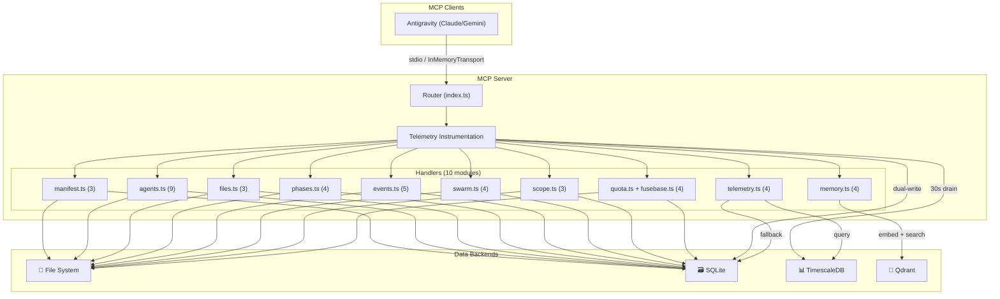

# Architecture Overview

> Agent Coordinator MCP Server — system architecture and data flow.

---

## System Overview



---

## Handler Architecture

The original monolithic `index.ts` (1900 lines) was refactored in M1 into a thin router that dispatches to **10 domain-specific handler modules**.

### Router (`src/index.ts`)

1. Receives MCP `CallToolRequest`
2. Records telemetry start timestamp
3. Looks up handler in `TOOL_HANDLERS` map
4. Calls handler with `args`
5. Records telemetry end (success/failure, duration)
6. Returns result to client

### Tool Registration

- **Schemas:** `src/handlers/tool-definitions.ts` — array of 39 tool schemas (name, description, inputSchema)
- **Handlers:** `src/handlers/index.ts` — `TOOL_HANDLERS` map linking tool names to handler functions
- **Pattern:** To add a new tool: define schema → write handler → register in map

### Handler Modules

| Module | Tools | Responsibility |
|--------|-------|----------------|
| `manifest.ts` | 3 | Create, read, and update the `swarm-manifest.md` |
| `agents.ts` | 9 | Agent lifecycle: add, update, remove, reassign, prompts |
| `files.ts` | 3 | File-level claims to prevent concurrent edits |
| `phases.ts` | 4 | Sequential phase gates with atomic advance |
| `events.ts` | 5 | Event broadcasting, handoff notes (with auto-index), issues |
| `swarm.ts` | 4 | Swarm status, completion, active-swarm registry |
| `memory.ts` | 4 | Qdrant semantic search and storage |
| `telemetry.ts` | 4 | Query tool call history and performance metrics |
| `scope.ts` | 3 | Scope negotiation (request, grant, deny) |
| `quota.ts` + `fusebase.ts` | 4 | Model quota checks and Fusebase dual-write resilience |

### Shared Utilities

- `context.ts` — `resolveWorkspaceRoot()`, `ToolResponse` type, `ToolHandler` type
- `shared.ts` — Common helpers used across multiple handler modules
- `utils/manifest.ts` — Markdown table parser/serializer

---

## Storage Layer

### `StorageAdapter` Interface

Defined in `src/storage/adapter.ts` — abstracts all state operations:

```
readManifest(wsRoot) / writeManifest(wsRoot, content)
getAgent(wsRoot, agentId) / addAgent(...) / updateAgent(...)
addFileClaim(...) / getFileClaim(...) / releaseFileClaim(...)
readAgentProgress(...) / writeAgentProgress(...)
addEvent(...) / getEvents(...) / addIssue(...)
checkPhaseGate(...) / updatePhaseGate(...)
withManifestLock(wsRoot, callback) — atomic read-modify-write
```

### Two Implementations

| Implementation | When | Notes |
|----------------|------|-------|
| `FileStorageAdapter` | `STORAGE_BACKEND=file` (default) | All state in `swarm-manifest.md` + `.agent-coordinator/` files |
| `SqliteStorageAdapter` | `STORAGE_BACKEND=sqlite` | All state in SQLite database, manifest as blob |

### Singleton Pattern

```typescript
import { initStorage, getStorage } from "./storage/singleton.js";

// At startup:
initStorage("sqlite"); // or "file"

// In handlers:
const storage = getStorage();
storage.readManifest(wsRoot);
```

### Known Gap

`add_agent_to_manifest` writes to the `manifest_content` markdown blob but does **not** call `storage.addAgent()`. This means `get_my_assignment` fails in SQLite mode because `getAgent()` queries the `agents` table, which is empty. Documented for M6 fix.

---

## Telemetry Pipeline

### Dual-Write Architecture

```
Tool call → TelemetryClient.record() → SQLite buffer (always)
                                     → TimescaleDB (if connected)

Every 30 seconds:
  SQLite buffer → drain to TimescaleDB (if connected)
  Successful rows → purged from buffer
```

### Components

- `src/telemetry/client.ts` — `TelemetryClient` class
- SQLite table: `telemetry_buffer` (always available)
- TimescaleDB table: `tool_calls` (hypertable, partitioned by `called_at`)

### Soft Dependency

- `TSDB_URL` not set → SQLite-only telemetry (query tools still work via local buffer)
- `TSDB_URL` set but connection fails → buffers locally, retries on next drain cycle
- 4 telemetry query tools fall back to SQLite when TSDB is unreachable

---

## Semantic Memory (Qdrant)

### Architecture

```
store_memory(text)
  → lazy-load @xenova/transformers pipeline (first use only, ~1s)
  → embed(text) → 384-dim float vector
  → upsert to Qdrant collection

semantic_search(query)
  → embed(query)
  → search Qdrant with cosine similarity
  → return results with score >= 0.5
```

### Components

- `src/memory/client.ts` — `MemoryClient` class (embed, store, search)
- `src/memory/collections.ts` — Collection definitions and model config

### Collections

| Collection | Content | Typical Sources |
|------------|---------|-----------------|
| `agent_notes` | Handoff notes, observations, decisions | `post_handoff_note` (auto-indexed), `store_memory` |
| `code_snippets` | Code fragments with file context | `store_memory` with `collection: "code_snippets"` |
| `project_docs` | Specs, plans, walkthroughs | `store_memory` with `collection: "project_docs"` |
| `issues` | Issues and their resolutions | `store_memory` with `collection: "issues"` |

### Embedding Model

- **Model:** `Xenova/all-MiniLM-L6-v2` (pinned in `collections.ts`)
- **Dimensions:** 384
- **Distance:** Cosine
- **Cache:** `~/.cache/Xenova/` (~40MB on first download)

### Soft Dependency

- `QDRANT_URL` not set → `initMemory()` returns immediately, `getMemory()` returns `null`
- All 4 tools return `"Semantic memory is not configured"` with `isError: false`
- `post_handoff_note` auto-index is fire-and-forget (`.catch(() => {})`)

---

## Testing Architecture

### Test Harness

Integration tests use `InMemoryTransport` from `@modelcontextprotocol/sdk` — no subprocess, no stdio, runs entirely in-process.

```typescript
const server = await createTestServer(tmpDir, { backend: "file" });
const result = await server.callTool("create_swarm_manifest", { mission: "test" });
await server.close();
```

### Test Organization

| Suite | File | Tests | Coverage |
|-------|------|-------|----------|
| M1 | `m1-handlers.test.ts` | 15 | Core tool handlers |
| M2 | `m2-sqlite.test.ts` | 9 | SQLite storage backend |
| M3 | `m3-telemetry.test.ts` | 9 (2 skip) | Telemetry pipeline |
| M4 | `m4-qdrant.test.ts` | 11 (4 skip) | Semantic memory |

### Milestone Gate

`scripts/integration-gate.ps1` runs all checks:

1. `npx tsc --noEmit` — TypeScript compilation (prod)
2. `npx tsc -p tsconfig.test.json --noEmit` — TypeScript compilation (tests)
3. `npm test` — Unit tests
4. `npm run test:integration` — Integration tests

**Rule:** No milestone can ship until the gate exits 0.
