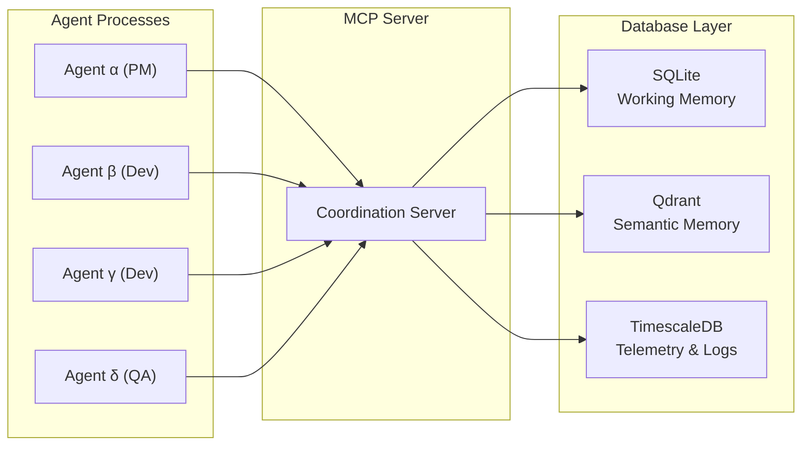

# Agent Coordinator — Unified Project Roadmap

## Vision

A unified multi-agent coordination system for Antigravity where model-shifting is the **default operating mode**. Any task can be scoped, planned, and handed off to a single agent or a swarm, with each agent running on the model best suited for its work. Quota awareness ensures agents are dispatched to models that have capacity.

---

## Available Models

Sourced from [Antigravity Cockpit](https://github.com/jlcodes99/vscode-antigravity-cockpit) extension.

> [!NOTE]
> The tables below are illustrative snapshots. For exact, current model names used by the system, see `src/model_fallback.json` — that file is the single source of truth.

| Label | Internal ID | Tier | Best For |
|-------|-------------|------|----------|
| Claude Opus 4.5 (Thinking) | `MODEL_PLACEHOLDER_M12` | 1 — Architect | Deep reasoning, architecture, subtle debugging |
| Claude Sonnet 4.5 | `MODEL_CLAUDE_4_5_SONNET` | 1 — Precision | Code review, plan alignment, security analysis |
| Claude Sonnet 4.5 (Thinking) | `MODEL_CLAUDE_4_5_SONNET_THINKING` | 1 — Precision+ | Complex debugging with reasoning traces |
| Gemini 3 Pro (High) | `MODEL_PLACEHOLDER_M7` | 2 — Workhorse | Large context, multi-file implementation, refactoring |
| Gemini 3 Pro (Low) | `MODEL_PLACEHOLDER_M8` | 2 — Economy | Same capabilities, lower quality/cost tier |
| Gemini 3 Pro Image | `MODEL_PLACEHOLDER_M9` | 2 — Visual | Image generation and analysis tasks |
| Gemini 3 Flash | `MODEL_PLACEHOLDER_M18` | 3 — Speed | Fast iteration, docs, formatting, simple fixes |
| GPT-OSS 120B (Medium) | `MODEL_OPENAI_GPT_OSS_120B_MEDIUM` | 2 — Alternative | Alternative reasoning, diverse perspective |

### Agent-to-Model Mapping

| Agent Role | Primary Model | Fallback | Rationale |
|------------|--------------|----------|-----------|
| **Project Manager** | Claude Sonnet 4.5 (Thinking) | Gemini 3 Pro (High) | Needs reasoning + broad view |
| **Architect** | Claude Opus 4.5 (Thinking) | Claude Sonnet 4.5 (Thinking) | Deepest reasoning for design |
| **Developer** | Gemini 3 Pro (High) | Gemini 3 Pro (Low) | Large context for implementation |
| **Debugger** | Claude Sonnet 4.5 (Thinking) | Gemini 3 Pro (High) | Step-by-step root cause analysis |
| **QA** | Gemini 3 Flash | Gemini 3 Pro (Low) | Fast test execution and review |
| **Code Reviewer** | Claude Sonnet 4.5 | Gemini 3 Pro (High) | Quality and security focus |
| **DevOps** | Gemini 3 Flash | Gemini 3 Pro (Low) | Build/CI commands, fast checks |
| **Explorer** | Gemini 3 Pro (High) | Gemini 3 Flash | Broad codebase scanning |
| **Researcher** | Gemini 3 Pro (High) | GPT-OSS 120B | Web research, doc reading |

---

## Phase Overview

| Phase | Name | Status | Effort |
|-------|------|--------|--------|
| **1A** | Core Merge | ✅ Complete | Foundation — minimum viable system |
| **1B** | MCP Coordination Server | ✅ Complete | Programmatic manifest management via MCP tools |
| **1C** | Enhanced Operations | ✅ Complete | Supervision, autonomy, presets |
| **2A** | NotebookLM Integration | ✅ Complete | Research & persistent knowledge |
| **2B** | Fusebase Integration | ✅ Complete | Dual-write deliverables, kanban tracking, tagging |
| **2C** | Fusebase Agent Accounts | ✅ Complete | @mentions, comments, human↔agent communication |
| **3** | Cockpit Quota Awareness | ✅ Complete | Passive quota monitoring |
| **4** | Direct Quota API | ✅ Complete | Programmatic quota checking |
| **5** | Advanced Capabilities | ✅ Complete | Modular handlers, 3-backend architecture, docs |
| **5A** | SQLite — Working Memory | ✅ Complete | StorageAdapter, atomic writes, queryable state |
| **5B** | Qdrant — Semantic Memory | ✅ Complete | RAG, code search by meaning, knowledge retrieval |
| **5C** | TimescaleDB — Telemetry & Logs | ✅ Complete | Dual-write pipeline, agent_events, model_performance |
| **5D** | Documentation | ✅ Complete | Tool reference, architecture, operations, developer guide |
| **6** | Temporal RAG & CI | ✅ Complete | 2 new analytical tools (41 total), CI pipeline, doc sync |

---

## Phase 1A: Core Merge (Now)

Combine `swarm-coordinator` and `model-tag-team` into a single working system. **Goal: the user can run `/swarm` and get agents dispatched on the right models.**

### Deliverables

- Unified `GEMINI.md` — identity, default tag-team behaviors, always loaded
- Unified `SKILL.md` — full protocol (handoff + swarm + routing)
- Merged manifest schema — project state + agents + file claims + phase gates
- 9 agent prompt templates (PM, Architect, Developer, Debugger, QA, Code Reviewer, DevOps, Explorer, Researcher)
- Updated `model_fallback.json` with real model IDs from cockpit
- Core workflows: `/pivot`, `/resume`, `/swarm`, `/health`
- Install script that replaces both existing projects
- `spec.md` template — the contract agents work against

### Getting Started Flow

When the unified project is installed, the first-run experience:

```
1. Run install.ps1
   → Creates skill junction
   → Installs workflows
   → Writes GEMINI.md to global location
   → Validates NLM skill is accessible

2. User opens any project and types:
   /swarm Fix the login timeout bug

3. PM agent activates:
   → Reads SKILL.md
   → Analyzes the task
   → Writes spec.md (user approves)
   → Selects agents and models
   → Generates manifest
   → Dispatches Architect

4. Pipeline runs:
   PM → Architect → Developer(s) → QA → Report
```

### Spec Document (`spec.md`)

Before the Architect plans, the PM writes a `spec.md` using the template at [`src/templates/spec.md`](../src/templates/spec.md). This is the **contract** — every agent's work is measured against it.

The template includes sections for Acceptance Criteria, Constraints, Non-Functional Requirements, and Out of Scope. Example usage:

- PM writes → user approves → Architect references in plan.md → QA validates acceptance criteria → PM verifies at completion.

---

## Phase 1B: MCP Coordination Server (Next)

Expose manifest-based coordination as programmatic MCP tools so the AI can manage the swarm lifecycle directly instead of generating instructions for the user to follow manually.

### Why MCP Before Enhanced Operations

| Without MCP Server | With MCP Server |
|---|---|
| AI generates text instructions for user | AI calls tools to manage manifest directly |
| User manually copies prompts to Agent Manager | AI populates prompts and presents for dispatch |
| User manually checks manifest for phase gates | AI calls `check_phase_gates` tool |
| File claims tracked by convention only | AI calls `claim_file` / `check_file_claim` tools |
| No structured status — user reads raw manifest | AI calls `get_swarm_status` for parsed summary |

Every subsequent phase (supervision levels, autonomous mode, presets) becomes **dramatically simpler** to implement when coordination is tool-based rather than text-based.

### Architecture

```
Antigravity Agent
  ↕ MCP Protocol (stdio)
Coordination MCP Server (TypeScript)
  ↕ File I/O
swarm-manifest.md + model_fallback.json
```

The server is a **stateless file adapter** — it reads and writes the manifest and config files. All coordination state lives in the manifest (single source of truth).

### Tool Catalog

#### Manifest Management (4 tools)

| Tool | Description | Parameters |
|------|-------------|------------|
| `create_swarm_manifest` | Initialize a new manifest from template | `mission`, `supervision_level` |
| `read_manifest_section` | Read a specific section of the manifest | `section` (agents, file_claims, phase_gates, issues, handoff_notes, branches) |
| `update_agent_status` | Update an agent's status in the Agents table | `agent_id`, `status` (active, complete, blocked, pending) |
| `check_phase_gates` | Check if all agents in a phase are complete | `phase_number` |

#### File Coordination (3 tools)

| Tool | Description | Parameters |
|------|-------------|------------|
| `claim_file` | Register a file claim before editing | `agent_id`, `file_path` |
| `check_file_claim` | Check if a file is already claimed | `file_path` |
| `release_file_claim` | Release a claim after editing | `agent_id`, `file_path`, `status` (done, abandoned) |

#### Agent Dispatch (3 tools)

| Tool | Description | Parameters |
|------|-------------|------------|
| `get_agent_prompt` | Generate a populated prompt for a role | `role`, `mission`, `scope`, `agent_id` |
| `report_issue` | Add an issue to the manifest | `severity`, `area`, `description`, `reporter` |
| `get_swarm_status` | Return a structured status summary | (none) |

#### Resources (2 resources)

| URI | Description |
|-----|-------------|
| `manifest://current` | Current `swarm-manifest.md` contents |
| `config://models` | `model_fallback.json` with routing info |

### Implementation

- **Runtime**: TypeScript with `@modelcontextprotocol/sdk`
- **Transport**: stdio (standard for Antigravity MCP servers)
- **State**: Stateless — reads/writes `swarm-manifest.md` directly
- **Location**: `src/mcp-server/` in this repository
- **Install**: `install.ps1`/`install.sh` register the server in Antigravity's MCP config

### Deliverables

- MCP server with 10 tools + 2 resources
- Manifest parser (read/write markdown tables)
- Prompt populator (reads agent prompt templates, fills variables)
- Install script integration (registers MCP server config)
- Updated SKILL.md with MCP tool usage documentation
- Updated workflows to use MCP tools when available

---

## Phase 1C: Enhanced Operations

Layer on sophistication for power users. **Goal: full control over supervision level, autonomous operation, and error recovery.**

### Deliverables

- 4 supervision levels (Full → Gate Only → Review End → Autonomous)
- Autonomous mode via `--auto` flag with settings backup/restore
- Cross-model consultation (`/consult`)
- Progress dashboard (`/status`)
- Error recovery protocol
- Git branch strategy with merge protocol
- 6 swarm presets

### Supervision Levels

| Level | Name | Flag | Behavior |
|-------|------|------|----------|
| 1 | **Full Supervision** | (default) | User approves every phase gate, reviews plan, reviews code |
| 2 | **Gate Only** | `--gates` | Agents run autonomously within phases, user approves phase transitions |
| 3 | **Review on Completion** | `--review-end` | Agents run the full pipeline, user reviews only at the end |
| 4 | **Full Autonomous** | `--auto` | No gates, no approvals, agents run to completion |

```
/swarm --gates Refactor the billing module      ← Level 2
/swarm --auto Add multi-currency support         ← Level 4
/swarm Redesign the auth flow                    ← Level 1 (default)
```

### Autonomous Mode (`--auto`)

When the `--auto` flag is present, the coordinator agent:

1. **Saves current settings** to `~/.antigravity-configs/settings_backup.json`
2. **Toggles Antigravity settings** for autonomous operation:

```json
{
  "cascade.autoRunCommands": true,
  "cascade.allowInBackground": true,
  "cascade.autoApproveEdits": true
}
```

1. **Adds auto-mode markers** to the manifest
2. **Restores original settings** when the swarm completes

#### Safety

| Safeguard | How |
|-----------|-----|
| **Settings backup** | Original settings saved before toggle, restored after completion |
| **Scope limits** | Agents still respect file claims and scope boundaries |
| **Manifest audit trail** | All auto-executed commands logged in `## Handoff Notes` |
| **Emergency stop** | User can always cancel via Agent Manager (`Ctrl+E`) |
| **Restore on failure** | `/health` detects orphaned backup and offers restore |

> [!IMPORTANT]
> The exact setting keys need to be verified against the current Antigravity version. The keys above are based on the Cockpit extension's type system (`cascadeCanAutoRunCommands`, `canAllowCascadeInBackground`). The actual VS Code `settings.json` keys may differ slightly.

### Cross-Model Consultation (`/consult`)

When an agent is stuck, instead of a full handoff it can ask a different model for help while **keeping its own context intact**.

#### The Escalation Ladder

| Situation | Action | Cost |
|-----------|--------|------|
| Stuck for 1-2 attempts | Keep trying | Free |
| Stuck for 3+ attempts | **Consult** another model | Low — focused question only |
| Context filling up | **Handoff** to fresh session | Medium — full manifest |
| Multi-track remaining work | **Swarm** to parallel agents | High — full decomposition |

#### How It Works

```
Agent A (stuck):
  1. Writes consult_request.md:
     - What I'm trying to do
     - What I've tried (and why it failed)
     - Specific question + minimal code context
  2. Recommends a model based on problem type
  3. Prompts user: "Dispatch this consult to [model]"

Agent B (consultant):
  1. Reads ONLY consult_request.md
  2. Writes consult_response.md with analysis + approach
  3. Done

Agent A (continues):
  1. Reads consult_response.md
  2. Applies the insight, keeps full context intact
```

| | Consult | Handoff |
|---|---|---|
| **Agent A's context** | Preserved | Lost |
| **Token cost** | Low — focused Q&A | High — full project state |
| **Time** | ~30 seconds | ~5 minutes |

In autonomous mode, consults are dispatched automatically.

### Progress Dashboard (`/status`)

```
User: /status

📊 Swarm Status: Billing Refactor
━━━━━━━━━━━━━━━━━━━━━━━━━━━━━━━
Mode: Gate Only (Level 2)
Phase: 2 of 3 (Implementation)

Agents:
  α PM           ✅ Complete  │ Claude Sonnet 4.5
  ε Architect    ✅ Complete  │ Claude Opus 4.5
  β Developer    🔄 Active   │ Gemini 3 Pro (High) │ 4 files claimed
  γ Developer    🔄 Active   │ Gemini 3 Pro (High) │ 3 files claimed
  δ QA           ⏳ Pending  │ Gemini 3 Flash

Phase Gates:
  [x] Phase 1 (Planning)
  [ ] Phase 2 (Implementation) — 2 agents active
  [ ] Phase 3 (Verification)

Issues: 1 🟡 BUG, 0 🔴 CONFLICT
Spec: 2/5 acceptance criteria met
━━━━━━━━━━━━━━━━━━━━━━━━━━━━━━━
```

### Error Recovery Protocol

```
Agent fails
  ↓
1. AUTO-RETRY — Same agent, fresh context, include failure context
  ↓ if retry fails
2. CONSULT — Ask a different model for guidance
  ↓ if still stuck
3. REPLACE — Spawn new agent on fallback model
  ↓ if replacement fails
4. ESCALATE — Flag as 🔴 BLOCKED, alert user
```

| Recovery Step | Auto Mode | Supervised Mode |
|---------------|-----------|-----------------|
| Auto-retry | Automatic | Automatic |
| Consult | Automatic | User dispatches |
| Replace | Automatic (PM picks fallback) | User picks replacement |
| Escalate | Pauses for user | Pauses for user |

### Git Branch Strategy

| Phase | Branch | Who |
|-------|--------|-----|
| Setup | `swarm/<task-slug>` | PM creates from `main` |
| Planning | `swarm/<task-slug>` | Architect works on base branch |
| Implementation | `swarm/<task-slug>/<agent-id>` | Each Developer gets a feature branch |
| Verification | `swarm/<task-slug>` | QA works on merged branch |
| Completion | → PR to `main` | PM creates final PR |

Merge conflicts → `## Issues` with `🔴 CONFLICT`. QA runs on merged base branch. PM creates final PR after QA signs off.

### Swarm Presets

| Preset | Command | Agents | Use Case |
|--------|---------|--------|----------|
| **Standard** | `/swarm <task>` | PM → Architect → Dev(s) → QA | Default |
| **Refactor** | `/swarm --preset=refactor` | Architect → 1 Dev → Code Reviewer | Restructure code |
| **Bugfix** | `/swarm --preset=bugfix` | Debugger → QA | Fast fix |
| **Feature** | `/swarm --preset=feature` | PM → Architect → 2 Devs → Code Reviewer → QA | Full pipeline |
| **Review** | `/swarm --preset=review` | Explorer → Code Reviewer | Read-only analysis |
| **Spike** | `/swarm --preset=spike` | Explorer → Researcher → Architect | Research + prototype |

Combinable: `/swarm --preset=bugfix --auto Fix the login timeout`

---

## Phase 2A: NotebookLM Integration — Research & Knowledge Base

Leverage the installed [NotebookLM MCP](file:///C:/Users/ryanh/.gemini/antigravity/skills/nlm-skill/SKILL.md) to give agents a **persistent, queryable knowledge base** with built-in research and content generation.

### Why NotebookLM Before Qdrant

| Capability | Qdrant RAG | NotebookLM |
|------------|-----------|------------|
| **Available today** | Needs deployment | ✅ Already installed |
| **Web research** | Need separate tool | ✅ Built-in (`research start`) |
| **Drive integration** | Need separate tool | ✅ Built-in (`source add --drive`) |
| **Query knowledge** | Vector similarity | ✅ Natural language Q&A |
| **Cross-project** | Needs indexing pipeline | ✅ One notebook per project, queryable |
| **Content generation** | Not applicable | ✅ Reports, slides, summaries |

### Project Notebook Lifecycle

```
Swarm starts
  ↓
PM creates notebook: "Project: Billing Refactor"
  ↓ nlm alias set billing-refactor <notebook-id>
  ↓
Sources added throughout:
  - spec.md, plan.md (text sources)
  - Relevant docs/APIs (URLs)
  - Research results (web/drive discovery)
  ↓
Any agent queries: nlm notebook query <id> "question"
  ↓
On completion → nlm report create <id> --format "Briefing Doc" --confirm
  ↓
Notebook persists for future reference
```

### Agent-to-NLM Capability Mapping

| Agent | NLM Capability | How They Use It |
|-------|---------------|-----------------|
| **Project Manager** | `notebook create`, `note create`, `report create` | Creates project notebook, generates completion reports |
| **Researcher** | `research start`, `source add`, `notebook query` | **Primary NLM user** — web/drive research, imports sources |
| **Architect** | `notebook query`, `source describe` | Queries for patterns, asks "has this been solved before?" |
| **Explorer** | `notebook query`, `source add` | Adds codebase docs, queries for architecture patterns |
| **Developer** | `notebook query` | "How should I implement X based on the research?" |
| **Debugger** | `notebook query` | "Has this error pattern been seen before?" |
| **QA** | `notebook query` | "What are the acceptance criteria?" |
| **Code Reviewer** | `notebook query` | "What constraints does the spec define?" |
| **DevOps** | `notebook query` | "What's the deployment strategy from the plan?" |

### Cross-Project Knowledge

```
Project A notebook: "Project: Billing Refactor"
  └─ Sources: spec, plan, research, walkthroughs

PM starting Project B:
  1. nlm notebook list                    # See all project notebooks
  2. nlm notebook query <project-a-id> "relevant patterns for currency handling"
  3. Import findings into Project B's notebook
```

Each completed project leaves behind a **queryable knowledge artifact**.

### Content Generation at Completion

| Product | NLM Command | Use Case |
|---------|------------|----------|
| **Briefing Doc** | `nlm report create <id> --format "Briefing Doc"` | Executive summary |
| **Study Guide** | `nlm report create <id> --format "Study Guide"` | Onboarding doc |
| **Mind Map** | `nlm mindmap create <id>` | Visual overview |
| **Slide Deck** | `nlm slides create <id>` | Stakeholder presentation |
| **Podcast** | `nlm audio create <id> --format deep_dive` | Audio walkthrough |

### NLM Limits & Monitoring

> [!NOTE]
> User is on **Google AI Ultra → NLM Pro plan** (300 sources/notebook).

| Limit | Value (Pro) |
|-------|-------------|
| **Sources per notebook** | 300 |
| **Words per source** | 500,000 |
| **File upload size** | 200 MB |
| **Google Slides per source** | 100 slides |
| **Google Sheets per source** | 100K tokens |

#### Source Monitoring

PM tracks usage in the manifest's `## Notebook` section:

```markdown
## Notebook
| Field | Value |
|-------|-------|
| Notebook ID | `abc123-def456` |
| Alias | `billing-refactor` |
| Plan Limit | 300 sources (Pro) |
| Current Sources | 34 |
| Headroom | 266 remaining |
```

**Rules:**

1. Check count before adding sources
2. If within 5 of limit → alert PM
3. If at limit → PM creates overflow notebook
4. Research agents use `--indices` to selectively import, not bulk-import

#### Notebook Overflow

```
Naming convention:
  Project: <name>                    ← Primary (spec, plan, current sources)
  Project: <name> — Research         ← Research overflow
  Project: <name> — Archive          ← Completed-phase sources

Aliases:
  billing-refactor
  billing-refactor-research
  billing-refactor-archive
```

#### Per-Source Size Awareness

| Source Type | Risk | Mitigation |
|-------------|------|------------|
| Full codebase dump | Exceeds 500K words | Add specific files only |
| Long conversation logs | Can exceed limits | Summarize first |
| Large PDFs | May hit 200MB | Split or use URL |
| API documentation sites | Fine as URL | NLM extracts content |

### Deliverables

- Researcher agent prompt updated to use NLM as primary research tool
- All agent prompts updated with `notebook query` for knowledge retrieval
- PM creates/manages project notebooks in swarm lifecycle
- Manifest includes `## Notebook` section
- Source limit monitoring in PM behavior
- Cross-project query documented in SKILL.md

### Open Questions

- Should old project notebooks be archived or kept active indefinitely?
- NLM session expires ~20 min — how to handle re-auth during long swarms?
- Should we auto-generate a podcast/report at the end of every swarm?

---

## Phase 2B: Fusebase Integration — Deliverables, Tracking & Dual-Write

Leverage the [Fusebase MCP](file:///c:/scripts/fusebase-mcp) (46 tools, reverse-engineered API) to give agents a **persistent, structured storage layer** for all project artifacts, with a dual-write strategy that keeps agents reliable while giving humans a polished UI.

### Core Principle: Dual-Write

**Fusebase is for human visibility, local files are for agent reliability.**

| Layer | Source of Truth For | Why |
|-------|-------------------|-----|
| **Local files** (`spec.md`, `plan.md`, `swarm-docs/`) | Agents | Always available, `grep`-able, no auth, works offline |
| **Fusebase pages** | Humans | Rich UI, comments, collaboration, persistent across branches |

Agents write to **both** simultaneously. If Fusebase is down, local files keep the swarm running. Once Fusebase MCP is battle-tested (after 10+ swarms), consider inverting the flow — Fusebase as source, local files as generated exports.

### What Lives in Fusebase

| Artifact | Fusebase Type | Who Writes | Dual-Write Local |
|----------|--------------|------------|-----------------|
| **Spec** | Page | PM | `spec.md` |
| **Architecture Plan** | Page | Architect | `plan.md` |
| **Implementation Notes** | Page per agent | Developer | `swarm-docs/<agent-id>-notes.md` |
| **Test Results** | Page | QA | `swarm-docs/<agent-id>-test-results.md` |
| **Code Review** | Page | Code Reviewer | `swarm-docs/<agent-id>-review.md` |
| **Research Findings** | Page | Researcher | `swarm-docs/<agent-id>-research.md` |
| **RCA / Debug Log** | Page | Debugger | `swarm-docs/<agent-id>-rca.md` |
| **Swarm Report** | Page | PM (final) | `swarm-report.md` |
| **Task Board** | Kanban page | PM + agents | Manifest `## Agents` table |

### Workspace Structure

```
Workspace: "Agent Swarm Projects"
  └─ Folder: "Billing Refactor" (tagged: #active, #swarm)
     ├─ 📄 Spec                    ← PM writes, user approves
     ├─ 📄 Architecture Plan       ← Architect writes
     ├─ 📁 Implementation
     │  ├─ 📄 Developer β Notes    ← Developer working notes
     │  └─ 📄 Developer γ Notes
     ├─ 📁 QA & Testing
     │  ├─ 📄 Test Results         ← QA writes
     │  └─ 📄 Code Review Report   ← Code Reviewer writes
     ├─ 📄 Swarm Report            ← PM final summary
     └─ 📋 Task Board              ← Kanban for all agent tasks
```

### Kanban Board Integration

The PM creates a Fusebase kanban board on swarm start. Agents update their card at **phase boundaries only** (not on every status change — that would be too noisy):

```
📋 Task Board: "Billing Refactor"

| Backlog         | In Progress     | Review          | Done            |
|-----------------|-----------------|-----------------|-----------------|
| γ: Payment API  |                 |                 | ε: Architecture |
|                 | β: Gateway impl | δ: Test suite   | α: Spec         |
```

**Update triggers** (one task-board write per trigger):

- Agent starts work → moves card to "In Progress"
- Agent marks `⏸️ Blocked` → moves card to "Blocked" column
- Agent marks `✅ Complete` → moves card to "Done"

The `/status` command reads both the manifest AND the Fusebase task board for a unified view.

### Fusebase vs NotebookLM — Complementary Roles

| Dimension | NotebookLM | Fusebase |
|-----------|-----------|----------|
| **Primary use** | Research & knowledge queries | Document storage & project tracking |
| **Content type** | External sources, Q&A | Agent-written artifacts, specs, reports |
| **Interaction** | Query (ask questions) | CRUD (create, read, update pages) |
| **Persistence** | Notebook per project | Workspace with folders, pages, tasks |
| **Cross-project** | Query old notebooks | Search + tags across all projects |
| **Collaboration** | Read-only for agents | Full read/write with comments |

**Together:** NLM is the **brain** (research, analyze, query). Fusebase is the **filing cabinet** (store, organize, track, share).

### Tagging Convention

| Tag | Purpose |
|-----|---------|
| `#swarm` | All pages created by a swarm |
| `#active` / `#completed` / `#archived` | Lifecycle state |
| `#spec` / `#plan` / `#qa` / `#review` | Document type |
| `#agent-β` / `#agent-γ` | Which agent authored it |
| `#project:<name>` | Project grouping |

### Deliverables

- Dual-write pattern: agents write to both Fusebase and local files
- PM creates project folder structure and task board on swarm start
- Kanban board updates at phase boundaries
- Tagging convention for cross-project discovery
- `/status` reads both manifest and Fusebase task board
- SKILL.md documents Fusebase MCP tool usage

---

## Phase 2C: Fusebase Agent Accounts — Human↔Agent Communication

### The Vision

Give each agent a **Fusebase account** so the user can communicate with agents the same way they'd communicate with human team members — through comments, @mentions, and task assignments.

### Agent Accounts

Create dedicated Fusebase accounts for each agent role:

| Agent Role | Account | Display Name |
|-----------|---------|-------------|
| PM | `agent-pm@<domain>` | 🎯 Agent PM |
| Architect | `agent-architect@<domain>` | 🏗️ Agent Architect |
| Developer | `agent-dev-β@<domain>` | 💻 Agent β (Dev) |
| Developer | `agent-dev-γ@<domain>` | 💻 Agent γ (Dev) |
| QA | `agent-qa@<domain>` | 🧪 Agent QA |
| Code Reviewer | `agent-review@<domain>` | 🔍 Agent Review |
| Debugger | `agent-debug@<domain>` | 🐛 Agent Debug |
| DevOps | `agent-devops@<domain>` | ⚙️ Agent DevOps |

Each agent authenticates as its own account when writing to Fusebase. Comments, edits, and task updates show the agent's identity — making the collaboration log fully attributable.

### Human↔Agent Communication

The user can interact with agents through Fusebase's native collaboration features:

#### User → Agent (comments & @mentions)

```
User comments on Architecture Plan page:
  "@agent-dev-β Can you also handle the currency 
   conversion in the payment gateway? I think it 
   belongs in your scope."

Agent β's session:
  → Polls Fusebase for new comments/mentions
  → Reads the comment
  → Calls `request_scope_expansion` if needed
  → Replies in Fusebase: "Acknowledged — I'll add
    currency conversion to my scope. Requesting 
    scope expansion for utils/currency.ts"
```

#### Agent → User (deliverable review requests)

```
Architect writes plan page, then comments:
  "@user Architecture plan ready for review. Key 
   decisions: REST over GraphQL, Redis for caching.
   See Trade-offs section."

User reviews in Fusebase UI:
  → Reads plan in rich format
  → Leaves inline comments
  → @mentions architect with questions
  → Approves or requests changes
```

#### Agent → Agent (cross-agent collaboration)

```
QA finds a bug, @mentions the developer:
  "@agent-dev-β Found a null pointer in 
   PaymentGateway.process(). See issue #3."

Developer β sees mention, investigates, replies:
  "@agent-qa Fixed in commit abc123. The null check 
   was missing for optional currency field."
```

### Notification Polling

Since agents can't receive push notifications, they poll Fusebase for new comments/mentions at key checkpoints:

| Checkpoint | What Agent Does |
|-----------|----------------|
| **On start** | Poll for any comments since last agent session |
| **Before marking complete** | Poll for any last-minute user feedback |
| **Phase gate wait** | Poll periodically while waiting for approval |
| **After posting deliverable** | Poll for user review comments |

#### MCP Tool Extension

| Tool | Purpose |
|------|---------|
| `fusebase_poll_mentions` | Check for new @mentions for this agent |
| `fusebase_reply_comment` | Reply to a specific comment thread |
| `fusebase_post_review_request` | Post a comment requesting user review |

### Configuration

Agent accounts are configured in `model_fallback.json` (or a new `fusebase_accounts.json`):

```json
{
  "fusebase_accounts": {
    "project-manager": {
      "email": "agent-pm@yourdomain.com",
      "display_name": "🎯 Agent PM",
      "auth_token_env": "FUSEBASE_PM_TOKEN"
    },
    "developer": {
      "email": "agent-dev@yourdomain.com",
      "display_name": "💻 Agent Dev",
      "auth_token_env": "FUSEBASE_DEV_TOKEN"
    }
  }
}
```

### Deliverables

- Fusebase account setup guide (one account per agent role)
- Agent authentication per-account (token-based)
- Comment polling in agent lifecycle (on start, before complete, at gates)
- @mention parsing and response
- Fusebase MCP tools for comment/mention interaction
- User guide for communicating with agents via Fusebase

### Open Questions

- Should every swarm write to Fusebase, or only when `--docs` flag is set?
- How to handle Fusebase auth session expiry during long swarms?
- Should the Fusebase workspace be per-project or one shared workspace with folder isolation?
- How many concurrent agent accounts does Fusebase support on the current plan?
- Should agents poll for mentions on a timer, or only at defined checkpoints?

---

## Phase 3: Cockpit Quota Awareness (Near-term)

Leverage the [Antigravity Cockpit extension](https://github.com/jlcodes99/vscode-antigravity-cockpit) for quota-aware agent dispatch.

### What We Can Do Now (No Extension Changes)

- **GEMINI.md instruction**: Agents check cockpit status bar before dispatching. If quota < 30%, recommend fallback.
- **Pre-dispatch checklist**: `/swarm` workflow prompts user to confirm quota levels.
- **Manifest quota section**: `## Quota Check` section documents quota state at swarm start.

### Notification System

In supervised modes (Levels 1-3):

- **Agent completion message**: Each agent states *"Phase X complete, ready for review"*
- **Manifest watchfile**: `swarm_status.json` in project root

```json
{
  "task": "Billing Refactor",
  "phase": 2,
  "supervision": "gates",
  "agents_active": 2,
  "agents_complete": 2,
  "agents_pending": 1,
  "last_event": "β Developer completed",
  "needs_user_action": false,
  "timestamp": "2026-02-20T22:50:00Z"
}
```

### Deliverables

- Updated `GEMINI.md` with cockpit awareness instructions
- Quota pre-check step in workflows
- `## Quota Check` section in manifest template
- Fallback routing when primary model is exhausted
- `swarm_status.json` for progress tracking

---

## Phase 4: Direct Quota API (Future)

Build `quota-check.ps1` that calls the Antigravity Language Server API directly.

### Architecture

```
quota-check.ps1
  → Finds language_server_windows_x64.exe process
  → Extracts CSRF token + port
  → POST /exa.language_server_pb.LanguageServerService/GetUserStatus
  → Writes quota_snapshot.json

/swarm workflow
  → Reads quota_snapshot.json
  → Auto-selects models based on real-time quota
  → No user input needed
```

### Deliverables

- `scripts/quota-check.ps1` + `scripts/quota-check.sh`
- Workflow reads `quota_snapshot.json` for auto-routing
- Agents can run script mid-session to check before dispatch

### Open Questions

- Periodic background task or on-demand?
- Exclude depleted models or warn?
- TLS — LS uses self-signed certs (cockpit uses `rejectUnauthorized: false`)

---

## Phase 5: Advanced Capabilities ✅

### Database Architecture Overview

Three specialized databases replace the current file-based coordination with a production-grade data layer:


```mermaid
graph LR
    subgraph "Agent Processes"
        A1["Agent α (PM)"]
        A2["Agent β (Dev)"]
        A3["Agent γ (Dev)"]
        A4["Agent δ (QA)"]
    end

    subgraph "MCP Server"
        MCP["Coordination Server"]
    end

    subgraph "Database Layer"
        SQLITE["SQLite<br/>Working Memory"]
        QD["Qdrant<br/>Semantic Memory"]
        TS["TimescaleDB<br/>Telemetry & Logs"]
    end

    A1 & A2 & A3 & A4 --> MCP
    MCP --> SQLITE
    MCP --> QD
    MCP --> TS
```

| Database | Role | Primary Strength | Replaces |
|----------|------|-----------------|----------|
| **SQLite** | Working Memory / Sync | ACID writes, zero-dependency, queryable state | `swarm-manifest.md`, `.manifest-lock`, `swarm_status.json` |
| **Qdrant** | Long-Term Semantic Memory | RAG, finding code snippets by "meaning" | NotebookLM queries (supplements, doesn't replace) |
| **TimescaleDB** | Historical Telemetry / Logs | Analyzing agent performance and "Temporal RAG" | `swarm-agent-*.json` progress files, `swarm_events/*.json` |

> [!NOTE]
> **Implementation Notes (2026-03):** Phase 5 is complete. SQLite was chosen over SpacetimeDB for Phase 5A — proven correct per Evaluation Gate 1 (polling is not a bottleneck, push notifications are unnecessary for current swarm sizes). All three backends implement graceful degradation: SQLite is always available; Qdrant and TimescaleDB fall back to SQLite or return informational messages when offline. The `StorageAdapter` interface bridges file-based and SQLite storage. Total tool count reached **41 MCP tools** across 10 domains.

### Strategic Analysis & Risk Assessment

> [!CAUTION]
> **Review this section before starting any Phase 5 work.** The analysis below was written on 2026-02-22 after completing the file-based write queue system. It captures genuine concerns about execution risk and recommends an evidence-based approach to avoid over-engineering.

#### What the three databases get right

- **SpacetimeDB** solves a real problem: the file mutex + markdown parsing pipeline is duct tape. Every handler doing `withManifestLock → read → parse tables → modify → serialize → write` is inherently fragile. ACID transactions would reduce each operation from ~30 lines to ~3.
- **Qdrant** fills a genuine gap: NotebookLM can't do "find me code that does X" across projects. Cross-project pattern retrieval is where the system gets smarter over time.
- **TimescaleDB's temporal RAG** answers questions ("which model debugs best?") that are impossible today but valuable after 10+ swarms.

#### Concerns

| Concern | Detail |
|---------|--------|
| **Zero to three databases** | Current system is a single TS process reading markdown files — zero dependencies, works anywhere. Three databases = Docker, networking, storage, backups, monitoring. Massive operational surface area jump. |
| **SpacetimeDB maturity** | Genuinely innovative but not battle-tested like Postgres/SQLite. Bugs in the WASM runtime or subscription engine become your debugging problem. |
| **Qdrant embedding pipeline** | "Chunking + embedding" glosses over real complexity: chunk sizing, code vs prose strategies, keeping embeddings fresh when code changes. Bad pipeline = garbage results, worse than nothing. |
| **Three failure modes** | Each database going down needs its own graceful degradation path. The file-based fallback must be real, not theoretical. |
| **NotebookLM may be enough** | For semantic search over project knowledge, NLM + good KIs may already suffice. Need evidence this is insufficient before building a Qdrant alternative. |

#### Recommended Execution Order

> [!IMPORTANT]
> Don't ship all three simultaneously. Let each prove its value before adding the next.

```
Phase 5A-pre: SQLite (not SpacetimeDB)
  → Same zero-infrastructure story as files, but proper ACID
  → Prove the relational data model works
  → Eliminate lock files and markdown parsing
  → Decision: does subscription-based sync justify SpacetimeDB's risk?
        │
        ▼
  ┌──────────────────────────────────────────┐
  │  🔶 EVALUATION GATE 1                   │
  │  After 5+ swarms on SQLite:             │
  │  - Is polling a real bottleneck?         │
  │  - Do agents need push notifications?   │
  │  - Is SQLite's concurrency sufficient?  │
  │  If YES → upgrade to SpacetimeDB        │
  │  If NO  → stay on SQLite                │
  └──────────────────────────────────────────┘
        │
        ▼
Phase 5C (before 5B): TimescaleDB
  → Simplest to implement: just emit events
  → Low risk, high insight
  → After 20 swarms: real data on model performance
        │
        ▼
  ┌──────────────────────────────────────────┐
  │  🔶 EVALUATION GATE 2                   │
  │  After 20+ swarms with telemetry:       │
  │  - Is NLM search sufficient for RAG?    │
  │  - Are agents often searching for code? │
  │  - Is cross-project retrieval needed?   │
  │  If YES → implement Qdrant (Phase 5B)   │
  │  If NO  → skip or defer                 │
  └──────────────────────────────────────────┘
        │
        ▼
Phase 5B: Qdrant (only if evidence supports it)
  → Vector search across code, docs, KIs
  → Investment justified by telemetry data
```

#### Alternatives Considered

| Option | Pros | Cons | Verdict |
|--------|------|------|---------|
| **SQLite instead of SpacetimeDB** | Zero-dep, battle-tested, same file story | No subscriptions, no server-side logic | Start here, upgrade later if needed |
| **Turso (libSQL)** | SQLite-compatible, edge replication | Another dependency to manage | Consider if multi-machine swarms needed |
| **Postgres instead of TimescaleDB** | More common, simpler | No hypertables, no continuous aggregates | TimescaleDB is Postgres with time-series extensions — low incremental risk |
| **LanceDB instead of Qdrant** | Embedded, no server, Rust-native | Newer, smaller ecosystem | Worth evaluating alongside Qdrant |

---

### Phase 5A: SQLite — Working Memory & Queryable State ✅

> **Decision:** SQLite was chosen over SpacetimeDB after evaluating the risk/benefit trade-off. SpacetimeDB's subscription model is innovative but adds operational complexity; SQLite provides ACID transactions with zero infrastructure. See *Strategic Analysis* above.

#### Why SQLite Over SpacetimeDB

| Factor | SpacetimeDB | SQLite (chosen) |
|--------|------------|-----------------|
| **ACID transactions** | ✅ Full ACID | ✅ Full ACID |
| **Dependencies** | Docker, WASM runtime | Zero — embedded in Node.js |
| **Push notifications** | ✅ Subscription model | ❌ Polling only |
| **Maturity** | Early, WASM-based | 20+ years, battle-tested |
| **Graceful degradation** | Complex fallback | File system always available |
| **Verdict** | Over-engineered for current scale | Right-sized, upgradeable later |

#### Implementation: StorageAdapter Pattern

All 35 manifest/coordination tools use a `StorageAdapter` interface that abstracts storage:

```typescript
interface StorageAdapter {
  getAgents(workspaceRoot: string): Promise<AgentRow[]>;
  upsertAgent(workspaceRoot: string, agent: AgentRow): Promise<void>;
  deleteAgent(workspaceRoot: string, agentId: string): Promise<void>;
  getFileClaims(workspaceRoot: string): Promise<FileClaimRow[]>;
  // ... 20+ methods covering all coordination domains
}
```

Two implementations:
- **`FileStorageAdapter`** — reads/writes `swarm-manifest.md` via markdown parsing (original, still default)
- **`SQLiteStorageAdapter`** — ACID writes to `~/.agent-coordinator/coordinator.db`

#### SQLite Schema

```sql
CREATE TABLE agents (
  workspace TEXT NOT NULL,
  agent_id  TEXT NOT NULL,
  role      TEXT, model TEXT, scope TEXT,
  phase     TEXT, status TEXT, detail TEXT,
  PRIMARY KEY (workspace, agent_id)
);

CREATE TABLE file_claims    (workspace, file_path PK, agent_id, status, claimed_at);
CREATE TABLE phase_gates    (workspace, phase PK, complete BOOLEAN, completed_at);
CREATE TABLE handoff_notes  (id INTEGER PK, workspace, agent_id, note, created_at);
CREATE TABLE issues         (id INTEGER PK, workspace, severity, description, reporter, created_at);
CREATE TABLE scope_requests (id INTEGER PK, workspace, agent_id, file_path, reason, status, resolved_at);
```

#### Deliverables ✅

- `StorageAdapter` interface with `FileStorageAdapter` bridge
- `SQLiteStorageAdapter` with full CRUD for all 6 tables
- `file-mutex.ts` for safe concurrent file access
- Transparent fallback: SQLite unavailable → file-based storage  
- Zero-config: DB created automatically on first use

---

### Phase 5B: Qdrant — Long-Term Semantic Memory ✅

Add vector-based semantic search across all agent outputs, code, and project history.

#### Why Qdrant

| Need | NotebookLM | Qdrant |
|------|-----------|--------|
| **"Find code that handles X"** | Natural language Q&A over sources | Vector similarity over embeddings |
| **Cross-project patterns** | Query one notebook at a time | Single query across all projects |
| **Code snippet retrieval** | Limited to uploaded sources | Indexes actual codebase |
| **Offline/airgapped** | Requires Google Cloud | Self-hosted, fully local |
| **Scale** | 300 sources per notebook | Millions of vectors |
| **Programmatic** | MCP tool calls | Native API + MCP integration |

> [!NOTE]
> Qdrant **supplements** NotebookLM, it doesn't replace it. NLM excels at research, web sources, and content generation. Qdrant excels at code search, pattern matching, and cross-project retrieval at scale.

#### What Gets Indexed

| Source | Embedding Strategy | Collection |
|--------|-------------------|------------|
| Code files | Per-function/class chunks | `code_snippets` |
| Specs & plans | Per-section chunks | `project_docs` |
| Walkthroughs | Full document | `walkthroughs` |
| Agent handoff notes | Per-note | `agent_notes` |
| Issues & resolutions | Per-issue with resolution | `issues` |
| KI artifacts | Full artifact | `knowledge_items` |

#### Use Cases

```
Developer β: "Find existing code that handles payment validation"
  → Qdrant searches code_snippets collection
  → Returns top-5 similar functions with file paths and line numbers

Architect: "Have we solved a similar caching problem before?"
  → Qdrant searches walkthroughs + issues collections
  → Returns past approaches with context

PM starting new project: "What patterns apply to API gateway design?"
  → Qdrant searches across all collections
  → Returns relevant code, docs, and past decisions
```

#### Indexing Pipeline

```
Project completion / swarm end
  ↓
Indexing trigger (async, non-blocking)
  ↓
Chunking + embedding (local model or API)
  ↓
Upsert to Qdrant with metadata
  (project, agent, phase, timestamp, file_path)
  ↓
Available for future queries
```

#### MCP Tools (implemented)

| Tool | Description |
|------|-------------|
| `store_memory` | Embed and store text into Qdrant |
| `semantic_search` | Query across all collections |
| `find_similar_code` | Code-specific similarity search |
| `find_past_solutions` | Search issues + agent notes for solutions |

#### Deliverables ✅

- Qdrant integration via `QDRANT_URL` env var
- `Xenova/all-MiniLM-L6-v2` embedding model (384-dim, cosine, lazy-loaded)
- 4 MCP tools for semantic memory (store, search, code, solutions)
- Auto-indexing: `post_handoff_note` auto-stores to `agent_notes` collection
- Graceful degradation: returns informational message when Qdrant offline
- 4 collections: `agent_notes`, `code_snippets`, `project_docs`, `issues`

---

### Phase 5C: TimescaleDB — Historical Telemetry & Temporal RAG ✅

Track all agent activity as time-series data for performance analysis, debugging, and "temporal RAG" (asking questions about what happened when).

#### Why TimescaleDB

| Need | Current Approach | TimescaleDB |
|------|-----------------|-------------|
| **Agent performance** | Manual observation | Query: avg completion time by model, failure rate by role |
| **"What happened?"** | Read agent JSON files | SQL over timestamped events |
| **Cost tracking** | Unknown | Token usage per agent per task |
| **Trend analysis** | Not possible | Continuous aggregates over weeks/months |
| **Audit trail** | Files deleted after swarm | Permanent, queryable history |

#### Schema

```sql
-- Hypertable: agent_events (auto-partitioned by time)
CREATE TABLE agent_events (
  time        TIMESTAMPTZ NOT NULL,
  swarm_id    TEXT NOT NULL,
  agent_id    TEXT NOT NULL,
  event_type  TEXT NOT NULL,  -- status_change, file_claim, issue_report, phase_advance, tool_call
  phase       INT,
  model       TEXT,
  detail      JSONB,
  duration_ms INT
);
SELECT create_hypertable('agent_events', 'time');

-- Hypertable: tool_calls (MCP tool invocation telemetry)
CREATE TABLE tool_calls (
  time        TIMESTAMPTZ NOT NULL,
  swarm_id    TEXT NOT NULL,
  agent_id    TEXT NOT NULL,
  tool_name   TEXT NOT NULL,
  args_hash   TEXT,
  duration_ms INT,
  success     BOOLEAN,
  error       TEXT
);
SELECT create_hypertable('tool_calls', 'time');

-- Continuous aggregate: model performance (auto-refreshed)
CREATE MATERIALIZED VIEW model_performance
WITH (timescaledb.continuous) AS
SELECT
  time_bucket('1 hour', time) AS bucket,
  model,
  COUNT(*) AS total_events,
  AVG(duration_ms) AS avg_duration,
  COUNT(*) FILTER (WHERE event_type = 'status_change' AND detail->>'status' ILIKE '%Failed%') AS failures
FROM agent_events
GROUP BY bucket, model;
```

#### Temporal RAG

Ask questions about historical agent behavior:

```
"Which model has the highest success rate for debugging tasks?"
  → Query model_performance WHERE role = 'Debugger' ORDER BY failure_rate ASC

"How long do Phase 2 implementations typically take?"
  → Query agent_events WHERE event_type = 'phase_advance' AND phase = 2

"What went wrong in the last 3 failed swarms?"
  → Query agent_events WHERE event_type = 'status_change' AND detail->>'status' ILIKE '%Failed%'
  → Join with tool_calls for error context
```

#### Dashboard Queries

| Metric | Query |
|--------|-------|
| Avg swarm duration | `SELECT AVG(duration) FROM swarm_runs` |
| Model failure rate | `SELECT model, COUNT(*) FILTER (WHERE NOT success) / COUNT(*) FROM tool_calls GROUP BY model` |
| Busiest agent roles | `SELECT role, COUNT(*) FROM agent_events GROUP BY role ORDER BY count DESC` |
| File conflict hotspots | `SELECT detail->>'file_path', COUNT(*) FROM agent_events WHERE event_type = 'issue_report' AND detail->>'severity' LIKE '%CONFLICT%' GROUP BY 1` |

#### MCP Tools (implemented)

| Tool | Description |
|------|-------------|
| `get_my_telemetry` | Your recent tool calls for the current session |
| `get_session_telemetry` | Aggregated telemetry for all agents |
| `get_slow_operations` | Tool calls exceeding duration threshold |
| `get_telemetry_summary` | High-level swarm telemetry summary |
| `get_swarm_history` | Past swarm session summaries (Phase 6) |
| `compare_models` | Head-to-head agent/model comparison (Phase 6) |

#### Deliverables ✅

- TimescaleDB deployment via Docker Compose (`docker-compose.test.yml`)
- Dual-write telemetry pipeline: TSDB primary, SQLite fallback
- `agent_events` hypertable + `model_performance` materialized view
- 6 MCP tools for telemetry queries (4 core + 2 temporal RAG)
- CI test runner (`scripts/ci-test.ps1`) for Part B integration tests

---

## Phase 6: Temporal RAG & CI ✅

Added cross-session analytical tools and CI infrastructure.

### New MCP Tools

| Tool | Domain | Description |
|------|--------|-------------|
| `get_swarm_history` | Telemetry | Past swarm session summaries: calls, duration, agents, failure rate |
| `compare_models` | Telemetry | Head-to-head model comparison: avg duration, success rate |

### CI Pipeline

- `docker-compose.test.yml` — TimescaleDB + Qdrant containers for Part B tests
- `scripts/ci-test.ps1` — Test runner with `-SkipPartB` and `-KeepContainers` flags
- Part A tests: SQLite fallback (always run, no dependencies)
- Part B tests: Live TSDB + Qdrant (require Docker)

### Documentation Sync

All docs updated to 41-tool state:
- `README.md`, `TOOL-REFERENCE.md`, `MCP-COVERAGE-GAPS.md`
- `tool-definitions.ts` header comment

---

## Future Phases

### Cockpit Extension Enhancements

- Cockpit watches `swarm_status.json` and surfaces notifications
- Quota-aware auto-routing without user input
- Visual swarm dashboard in cockpit webview

### Custom Agent Marketplace

- Community-contributed agent roles
- Domain-specific presets (ML, DevOps, frontend, data engineering)
- Agent prompt versioning and testing
